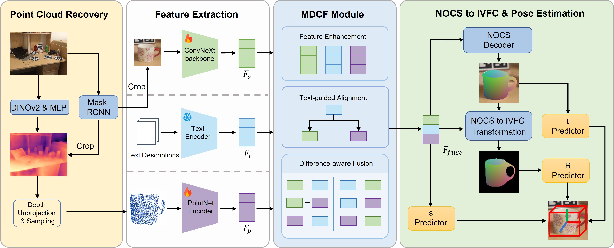

# Multi-modal Differential Fusion and Decoupled Pose Representation for RGB-based Category-level 6D Object Pose Estimation

This repository is the official project page of:

**Multi-modal Differential Fusion and Decoupled Pose Representation for RGB-based Category-level 6D Object Pose Estimation**

The source code will be released after the paper is accepted.

## Overview

RGB-based category-level 6D object pose estimation remains challenging due to the lack of explicit 3D geometric constraints and the difficulty of effectively exploiting complementary information from different modalities.

In this work, we propose MDPose, a novel framework that integrates visual, geometric, and semantic information through multimodal differential fusion and decoupled pose representation learning.

The proposed framework contains two key components:

- **Multi-modal Differential Cross Fusion (MDCF)** module, which explicitly models the differences and complementary relationships among visual, geometric, and semantic modalities for effective cross-modal feature interaction.

- **NOCS-IVFC pose representation decoupling strategy**, which assigns different geometric representations to rotation and translation estimation to better satisfy their distinct representation requirements.

MDPose achieves accurate RGB-based category-level 6D object pose estimation without requiring additional depth sensors.

## Framework

